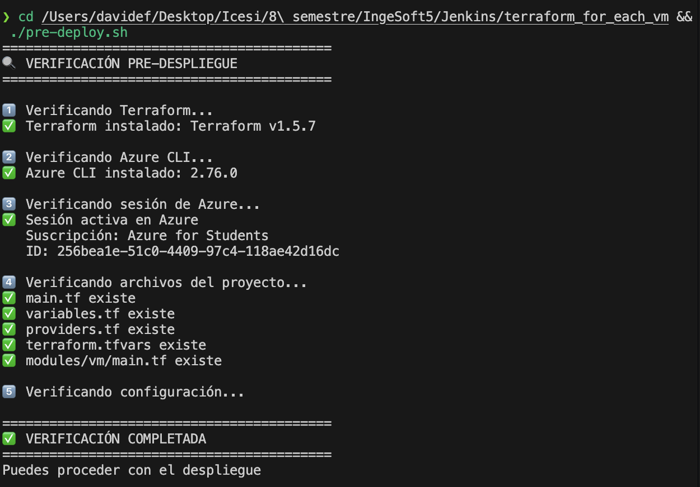
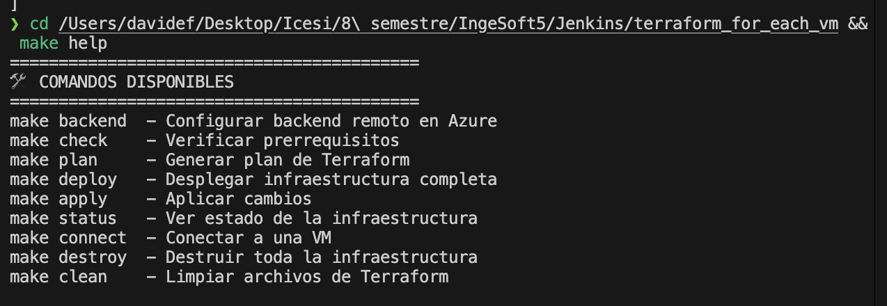
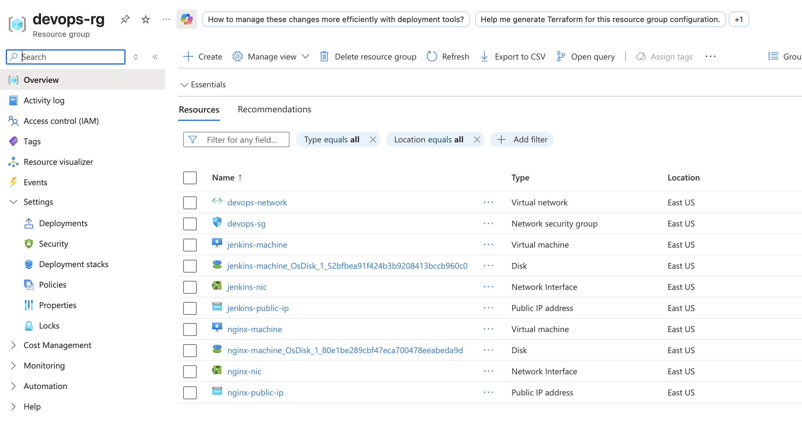

## 👥 Autores
### **Davide Flamini y  Andres Cabezas**

# 🚀 Terraform Multi-VM Deployment en Azure

Proyecto de infraestructura como código (IaC) para desplegar múltiples máquinas virtuales en Azure de forma automatizada usando Terraform con patrón `for_each` y backend remoto.

## 📑 Tabla de Contenidos

- [Descripción del Proyecto](#-descripción-del-proyecto)
- [Arquitectura](#-arquitectura)
- [Tecnologías Utilizadas](#-tecnologías-utilizadas)
- [Estructura del Proyecto](#-estructura-del-proyecto)
- [Cambios Realizados y Justificaciones](#-cambios-realizados-y-justificaciones)
- [Prerrequisitos](#-prerrequisitos)
- [Guía de Uso](#-guía-de-uso)
- [Scripts Automatizados](#-scripts-automatizados)
- [Evidencias de Despliegue](#-evidencias-de-despliegue)
- [Mejores Prácticas Implementadas](#-mejores-prácticas-implementadas)
- [Solución de Problemas](#-solución-de-problemas)
- [Recursos Creados](#-recursos-creados)

---

## 📖 Descripción del Proyecto

Este proyecto implementa una infraestructura completa en Azure para desplegar múltiples máquinas virtuales (VMs) de forma escalable y mantenible. Utiliza Terraform con módulos reutilizables y el patrón `for_each` para crear recursos de manera dinámica.

### Objetivos del Proyecto

- ✅ Desplegar infraestructura de VMs de forma automatizada
- ✅ Implementar mejores prácticas de IaC (Infrastructure as Code)
- ✅ Utilizar backend remoto para trabajo colaborativo
- ✅ Crear scripts de automatización para facilitar operaciones
- ✅ Documentar todo el proceso y decisiones técnicas

---

## 🏗️ Arquitectura

El proyecto despliega la siguiente arquitectura en Azure:

```
Azure Cloud (East US)
│
├── Resource Group: devops-rg
│   │
│   ├── Networking
│   │   ├── Virtual Network: devops-network (10.0.0.0/16)
│   │   └── Subnet: devops-subnet (10.0.1.0/24)
│   │
│   ├── VM Jenkins
│   │   ├── Public IP (Standard SKU)
│   │   ├── Network Interface
│   │   ├── Network Security Group
│   │   └── Linux VM (Ubuntu 16.04 LTS, Standard_B2s)
│   │
│   └── VM Nginx
│       ├── Public IP (Standard SKU)
│       ├── Network Interface
│       ├── Network Security Group
│       └── Linux VM (Ubuntu 16.04 LTS, Standard_B2s)
│
└── Backend Storage
    ├── Resource Group: terraform-backend-rg
    └── Storage Account: tfstate90941
        └── Container: tfstate
            └── terraform.tfstate (estado remoto)
```

---

## 🛠️ Tecnologías Utilizadas

| Tecnología | Versión | Propósito |
|------------|---------|-----------|
| Terraform | >= 1.0 | Infraestructura como Código |
| Azure CLI | 2.76.0+ | Gestión de recursos Azure |
| Azure Provider | ~> 3.0 | Provider de Terraform para Azure |
| Bash | - | Scripts de automatización |
| Make | - | Gestión de tareas |

---

## 📁 Estructura del Proyecto

```
terraform_for_each_vm/
├── main.tf                    # Configuración principal
├── variables.tf               # Definición de variables
├── outputs.tf                 # Outputs del despliegue
├── providers.tf               # Configuración de providers y backend
├── terraform.tfvars           # Valores de variables (no en Git)
├── terraform.tfvars.example   # Ejemplo de configuración
│
├── modules/
│   └── vm/
│       ├── main.tf            # Módulo de VMs con for_each
│       ├── variables.tf       # Variables del módulo
│       └── outputs.tf         # Outputs del módulo
│
├── scripts/
│   ├── setup-backend.sh       # Configurar backend remoto
│   ├── pre-deploy.sh          # Verificación previa
│   ├── deploy.sh              # Despliegue completo
│   ├── quick-deploy.sh        # Despliegue rápido
│   ├── status.sh              # Ver estado
│   ├── connect.sh             # Conexión SSH
│   └── destroy.sh             # Destruir infraestructura
│
├── Makefile                   # Comandos make
├── DEPLOY_GUIDE.md           # Guía de despliegue
├── .gitignore                # Archivos a ignorar
├── backend-config.txt        # Config del backend (generado)
└── img/                      # Evidencias y capturas
```

---

## 🔧 Cambios Realizados y Justificaciones

### 1. **Implementación de Backend Remoto en Azure Storage**

**Cambio**: Agregamos configuración de backend `azurerm` en `providers.tf`

```terraform
backend "azurerm" {
  resource_group_name  = "terraform-backend-rg"
  storage_account_name = "tfstate90941"
  container_name       = "tfstate"
  key                  = "terraform.tfstate"
}
```

**Justificación**:
- ✅ **Trabajo colaborativo**: Múltiples usuarios pueden trabajar sin conflictos
- ✅ **Estado centralizado**: El archivo tfstate se almacena en Azure Storage
- ✅ **Bloqueo de estado**: Previene modificaciones concurrentes
- ✅ **Backup automático**: Azure Storage tiene redundancia incorporada
- ✅ **Seguridad**: Encriptación en reposo y control de acceso

**Script creado**: `setup-backend.sh`


---

### 2. **Cambio de SKU de IP Pública: Basic → Standard**

**Cambio Original**:
```terraform
resource "azurerm_public_ip" "devops_ip" {
  allocation_method = "Static"
  # SKU no especificado (default: Basic)
}
```

**Cambio Aplicado**:
```terraform
resource "azurerm_public_ip" "devops_ip" {
  allocation_method = "Static"
  sku              = "Standard"  # ✅ Agregado
}
```

**Justificación**:
- ❌ **Problema encontrado**: Suscripción Azure for Students tiene límite de 0 IPs Basic
- ✅ **Solución**: Usar SKU Standard que tiene mejor disponibilidad
- ✅ **Beneficios adicionales**:
  - Mayor SLA (99.99%)
  - Mejor seguridad por defecto
  - Compatible con Load Balancers Standard

**Error original**:
```
Error: IPv4BasicSkuPublicIpCountLimitReached: Cannot create more than 0 
IPv4 Basic SKU public IP addresses for this subscription in this region.
```

---

### 3. **Cambio de Tamaño de VM: Standard_DS1_v2 → Standard_B2s**

**Cambio Aplicado**:
```terraform
module "vm" {
  size_servers = "Standard_B2s"  # Antes: Standard_DS1_v2
}
```

**Justificación**:
- ❌ **Problema**: `Standard_DS1_v2` no disponible en East US para la suscripción
- ✅ **Solución**: `Standard_B2s` es más común en suscripciones de estudiantes
- ✅ **Características**:
  - 2 vCPUs
  - 4 GB RAM
  - Ideal para Jenkins y Nginx
  - Económico para desarrollo/pruebas

**Error original**:
```
Error: SkuNotAvailable: The requested VM size 'Standard_DS1_v2' is 
currently not available in location 'eastus'
```

---

### 4. **Mejora de Requisitos de Contraseña**

**Cambio Original**:
```hcl
password = "adminuser"  # ❌ No cumple requisitos
```

**Cambio Aplicado**:
```hcl
password = "Admin@Pass123!"  # ✅ Cumple requisitos
```

**Justificación**:
- ❌ **Problema**: Azure requiere contraseñas que cumplan 3 de 4 condiciones:
  1. Letras minúsculas
  2. Letras mayúsculas
  3. Números
  4. Caracteres especiales

- ✅ **Nueva contraseña cumple**:
  - ✅ Minúsculas: `dmin`, `ass`
  - ✅ Mayúsculas: `A`, `P`
  - ✅ Números: `1`, `2`, `3`
  - ✅ Especiales: `@`, `!`

**Error original**:
```
Error: "admin_password" has to fulfill 3 out of these 4 conditions
```

---

### 5. **Creación de Scripts de Automatización**

**Scripts Creados**:

#### a) `setup-backend.sh`
- Configura backend remoto automáticamente
- Crea Resource Group, Storage Account y Container
- Actualiza `providers.tf` con la configuración

#### b) `pre-deploy.sh`
- Verifica Terraform instalado
- Verifica Azure CLI instalado
- Valida sesión de Azure activa
- Comprueba archivos del proyecto



#### c) `deploy.sh`
- Despliegue completo paso a paso
- Inicialización, validación y formato
- Genera plan y solicita confirmación
- Guarda información en `deployment-info.txt`


#### d) `status.sh`
- Muestra recursos creados
- Lista outputs (IPs públicas)
- Información de suscripción

#### e) `connect.sh`
- Conexión SSH simplificada
- Extrae IPs automáticamente
- Usa credenciales de terraform.tfvars


#### f) `destroy.sh`
- Destrucción segura con confirmaciones
- Requiere escribir "DESTROY"
- Doble confirmación

**Justificación**:
- ✅ **Automatización**: Reduce errores humanos
- ✅ **Consistencia**: Mismo proceso cada vez
- ✅ **Documentación**: Código auto-documentado
- ✅ **Productividad**: Menos comandos manuales

---

### 6. **Implementación de Makefile**

**Comandos Disponibles**:

```makefile
make backend  - Configurar backend remoto
make check    - Verificar prerrequisitos
make plan     - Generar plan de Terraform
make deploy   - Desplegar infraestructura
make status   - Ver estado
make connect  - Conectar a VM
make destroy  - Destruir infraestructura
make clean    - Limpiar archivos locales
```



**Justificación**:
- ✅ **Simplicidad**: Comandos cortos y memorables
- ✅ **Estándar**: Make es universalmente conocido
- ✅ **Documentación**: `make help` muestra todos los comandos

---

### 7. **Configuración de .gitignore**

**Archivos Excluidos**:
```gitignore
# Estado de Terraform
*.tfstate
*.tfstate.*
.terraform/

# Información sensible
*.tfvars
backend-config.txt
deployment-info.txt

# Archivos temporales
tfplan
*.backup
```

**Justificación**:
- ✅ **Seguridad**: No exponer contraseñas ni credenciales
- ✅ **Limpieza**: No versionar archivos generados
- ✅ **Colaboración**: Evitar conflictos de estado

---

### 8. **Uso del Patrón for_each en el Módulo**

**Implementación**:
```terraform
resource "azurerm_public_ip" "devops_ip" {
  for_each = var.servers  # {"jenkins", "nginx"}
  name     = "${each.value}-public-ip"
  # ...
}
```

**Justificación**:
- ✅ **Escalabilidad**: Agregar VMs solo modificando la lista
- ✅ **DRY**: No repetir código para cada VM
- ✅ **Mantenibilidad**: Un solo lugar para cambios
- ✅ **Flexibilidad**: Fácil agregar/quitar servidores

**Ejemplo de escalamiento**:
```hcl
servers = ["jenkins", "nginx", "sonarqube", "grafana"]
# Terraform creará automáticamente 4 VMs
```

---

## ✅ Prerrequisitos

### Software Necesario

```bash
# Terraform
terraform --version  # >= 1.0

# Azure CLI
az --version  # >= 2.76.0

# Git (opcional)
git --version
```


---

## 🚀 Guía de Uso

### Opción 1: Con Backend Remoto (Recomendado)

```bash
# 1. Clonar el repositorio
git clone https://github.com/davidone007/terraform_for_each_vm.git
cd terraform_for_each_vm

# 2. Dar permisos a los scripts
chmod +x *.sh

# 3. Configurar variables
cp terraform.tfvars.example terraform.tfvars
# Editar terraform.tfvars con tus valores

# 4. Login en Azure
az login

# 5. Configurar backend remoto
./setup-backend.sh

# 6. Verificar prerrequisitos
./pre-deploy.sh

# 7. Despliegue infraestructura
./deploy.sh

# 8. Ver estado
./status.sh

# 9. Conectar a una VM
./connect.sh

# 10. Destruir cuando termines
./destroy.sh
```

### Opción 2: Usando Makefile

```bash
make help      # Ver comandos disponibles
make backend   # Configurar backend
make check     # Verificar sistema
make deploy    # Desplegar todo
make status    # Ver estado
make connect   # Conectar a VM
make destroy   # Destruir todo
```

---

## 📜 Scripts Automatizados

### setup-backend.sh
Configura el backend remoto en Azure Storage de forma interactiva.

**Características**:
- Crea Resource Group para el backend
- Crea Storage Account con encriptación
- Crea Container para tfstate
- Actualiza providers.tf automáticamente
- Guarda configuración en backend-config.txt

### pre-deploy.sh
Verifica que el sistema esté listo para el despliegue.

**Validaciones**:
- ✅ Terraform instalado
- ✅ Azure CLI instalado
- ✅ Sesión de Azure activa
- ✅ Archivos del proyecto presentes
- ⚠️  Contraseña válida en terraform.tfvars

### deploy.sh
Despliega la infraestructura completa de forma guiada.

**Pasos automáticos**:
1. Limpieza opcional de .terraform
2. terraform init
3. terraform validate
4. terraform fmt -recursive
5. terraform plan -out=tfplan
6. terraform apply (con confirmación)
7. Guarda outputs en deployment-info.txt

### status.sh
Muestra el estado actual de la infraestructura.

**Información mostrada**:
- Lista de recursos creados
- IPs públicas de las VMs
- Suscripción de Azure actual

### connect.sh
Facilita la conexión SSH a las VMs.

**Funcionalidad**:
- Extrae IPs de terraform outputs
- Lee usuario de terraform.tfvars
- Conecta automáticamente por SSH

### destroy.sh
Destruye toda la infraestructura de forma segura.

**Protecciones**:
- Requiere escribir "DESTROY"
- Muestra lista de recursos a eliminar
- Doble confirmación antes de proceder

---

## 📸 Evidencias de Despliegue

### Resource Groups Creados


Se crearon dos Resource Groups:
1. `terraform-backend-rg` - Para el backend remoto
2. `devops-rg` - Para la infraestructura de VMs

### Recursos en devops-rg



Recursos desplegados:
- 2 Virtual Machines (jenkins-machine, nginx-machine)
- 2 Public IPs (Standard SKU)
- 2 Network Interfaces
- 1 Network Security Group
- 1 Virtual Network
- 1 Subnet

### Outputs del Despliegue


Información de las VMs:
```
ip_servers = [
  {
    ip   = "172.172.182.135"
    name = "jenkins-public-ip"
  },
  {
    ip   = "20.169.237.36"
    name = "nginx-public-ip"
  }
]
```

---

## 🎯 Mejores Prácticas Implementadas

### 1. **Infraestructura como Código (IaC)**
- Todo versionado en Git
- Reproducible en cualquier entorno
- Documentado y mantenible

### 2. **Modularización**
- Módulo reutilizable para VMs
- Separación de responsabilidades
- Fácil de extender

### 3. **Backend Remoto**
- Estado centralizado y seguro
- Trabajo colaborativo sin conflictos
- Backup automático

### 4. **Automatización**
- Scripts para operaciones comunes
- Makefile para simplicidad
- Validaciones automáticas

### 5. **Seguridad**
- Contraseñas en .gitignore
- Standard SKU para IPs públicas
- NSG con reglas específicas
- Backend con encriptación

### 6. **Documentación**
- README completo
- DEPLOY_GUIDE.md detallado
- Comentarios en código
- Evidencias visuales

---

## ❗ Solución de Problemas

### Error: "Terraform not found"
```bash
brew install terraform
```

### Error: "Azure CLI not found"
```bash
brew install azure-cli
```

### Error: "No active Azure session"
```bash
az login
```

### Error: "SKU not available"
- Cambiar región en `terraform.tfvars`
- O usar otro tamaño de VM

### Error: "Permission denied" en scripts
```bash
chmod +x *.sh
```

### Estado local vs remoto desincronizado
```bash
terraform init -reconfigure
terraform init -migrate-state
```

---

## 📦 Recursos Creados

El despliegue completo crea los siguientes recursos en Azure:

| Tipo de Recurso | Nombre | Cantidad |
|------------------|--------|----------|
| Resource Group | terraform-backend-rg | 1 |
| Storage Account | tfstate90941 | 1 |
| Storage Container | tfstate | 1 |
| Resource Group | devops-rg | 1 |
| Virtual Network | devops-network | 1 |
| Subnet | devops-subnet | 1 |
| Public IP | jenkins-public-ip | 1 |
| Public IP | nginx-public-ip | 1 |
| Network Interface | jenkins-nic | 1 |
| Network Interface | nginx-nic | 1 |
| Network Security Group | devops-sg | 1 |
| NSG Association | - | 2 |
| Linux Virtual Machine | jenkins-machine | 1 |
| Linux Virtual Machine | nginx-machine | 1 |

**Total**: ~15 recursos

---


## 🔗 Referencias

- [Terraform Documentation](https://www.terraform.io/docs)
- [Azure Provider](https://registry.terraform.io/providers/hashicorp/azurerm/latest/docs)
- [Terraform Best Practices](https://www.terraform-best-practices.com/)
- [Azure for Students](https://azure.microsoft.com/en-us/free/students/)

---

## 📞 Soporte

Para problemas o preguntas:
1. Revisar [DEPLOY_GUIDE.md](DEPLOY_GUIDE.md)
2. Verificar la sección de [Solución de Problemas](#-solución-de-problemas)
3. Revisar los logs de Terraform: `terraform show`

---

**Última actualización**: 13 de Octubre, 2025

# ⚠️ Advertencia sobre archivos sensibles y generados

> **IMPORTANTE:**
> Este repositorio incluye archivos sensibles y generados (como `terraform.tfvars`, archivos de estado, scripts, outputs, etc.) que normalmente **NO** deberían subirse a un repositorio público. Se han incluido aquí únicamente por motivos de aprendizaje y para facilitar la revisión y el trabajo colaborativo en el contexto académico.
>
> En un entorno profesional, estos archivos deben estar listados en `.gitignore` y nunca ser versionados para proteger credenciales, contraseñas, información de infraestructura y evitar conflictos de estado.
>
> **Ejemplos de archivos que normalmente se excluyen:**
> - `terraform.tfvars` y cualquier archivo `.tfvars`
> - `*.tfstate`, `*.tfstate.*`, `.terraform/`
> - `deployment-info.txt`, `backend-config.txt`, `tfplan`, `*.backup`
> - Claves SSH, contraseñas, outputs sensibles
>
> **Motivo de inclusión:**
> - Facilitar el aprendizaje y la revisión de la infraestructura completa
> - Permitir la ejecución y pruebas sin restricciones en el entorno académico
> - Mostrar ejemplos reales de configuración y despliegue
>
> **Recomendación:**
> - En proyectos reales, revisa y actualiza el `.gitignore` para proteger tu información
> - Nunca subas credenciales ni archivos de estado a repositorios públicos
